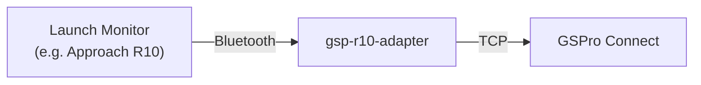
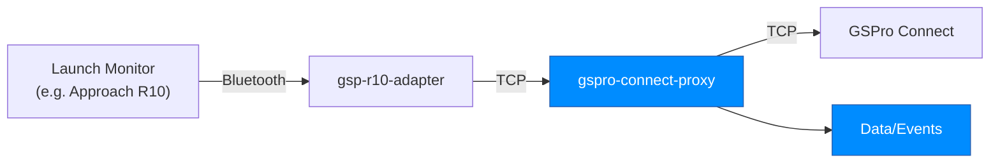

# gspro-connect-proxy
A simple TCP proxy to intercept GSPro and launch monitor data. Forwards data to and from your LM software and GSPro over TCP.


Before:


After:


Checkout the example in `example/simple.js` and modify it to your needs.

## Options


If you're like me, and use an Approach R10, I recommend using **[gsp-r10-adapter](https://github.com/mholow/gsp-r10-adapter)**. You can just edit the `settings.json` file and change the port from `921` to `1337`. This will allow the proxy to sit in between GSPro and the Launch Monitor.


### `serverConfig`

The TCP proxy server config. You'll want to point your R10 Connect Launch Monitor bridge at this instead of GSPro's default port `921`. 

| Option | Description | Default |
| ---- | ---- | ---- |
| `port` | The port to listen on</small> | `1337` |

Example:
```js
const serverConfig = {
  port: 1337
}
```

### `clientConfig`

| Option | Description | Default |
| ---- | ---- | ---- |
| `timeout` | The socket timeout in milliseconds | `5000` |
| `ip_address` | The IP address of machine running **GSPro Connect** | `5000` |
| `port` | The **GSPro Connect** port | `921` |


Example:
```js
const clientConfig = {
  timeout: 5000,
  ip_address: '192.168.1.100',
  port: 921
}
```